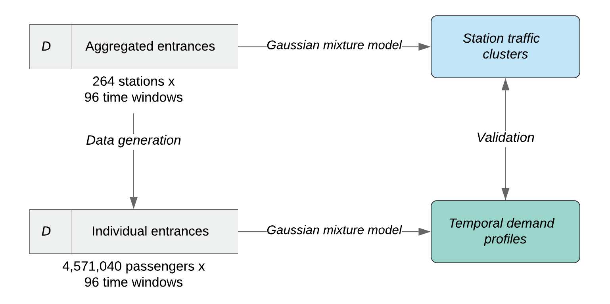
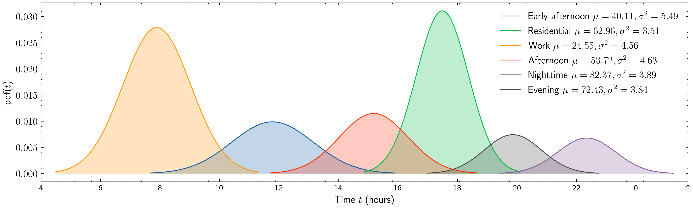
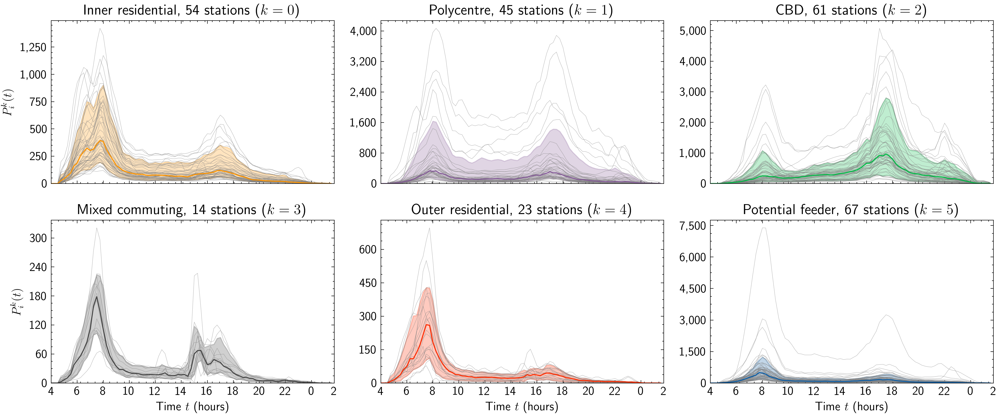

[](https://mybinder.org/v2/gh/mikhailsirenko/spacetimegeo/master)

spacetimegeo
==============================

An exploratory analysis of citizens mobility with a Gaussian mixture model. This repository is a part of research conducted by Verma et al. (2020).

Introduction
------------

Quite often, transportation planning operates with a simple model that takes into account only population counts. That is, the more people live in a neighbourhood, the more metro stations will be built to support expected demand. With this project, we aimed to explore relationships between the population of London neighbourhoods and ridership represented by "tap ins" made with [Oyster card](https://en.wikipedia.org/wiki/Oyster_card). 

Data
------------
In this research We used four open-access data sets:

1. Office for National Statistics (2019). Census Output Area population estimates – London, England (supporting information). Retrieved from https://www.ons.gov.uk/peoplepopulationandcommunity/populationandmigration/populationestimates/datasets/censusoutputareaestimatesinthelondonregionofengland
2. London Datastore (2019). Statistical GIS Boundary Files for London. Retrieved from https://data.london.gov.uk/dataset/statistical-gis-boundary-files-london
3. Transport for London (2020). Transport for London API. Retrieved from https://api-portal.tfl.gov.uk/docs
4. Wikimedia Commons (2020). London Underground geographic maps/CSV. Retrieved from https://commons.wikimedia.org/wiki/London_Underground_geographic_maps/CSV

Methods
------------
This study follows a standard logic of the data science project. First, we gather the data and preprocess it. Second, we explore the data with a couple of visualizations. Finally, we apply a Gaussian mixture model (GMM) to cluster the stations (aggregated tap in) as well as individual passengers (generated tap ins). The simplified workflow looks as follows:

<p align="center">
  
</p>

Main findings
------------
Clustering of individual passenger entrances resulted in six distinct *temporal profiles*. That is, each metro station is a unique combination of *work*, *early afternoon*, *afternoon*, *residential*, *evening* and *nighttime* traffic volumes.

<p align="center">
  
</p>

Clustering of station traffic in combination with the analysis of their locations revealed a *spatial pattern*. In total, we found 6 remarkable station traffic clusters. Depending on where the station is located, it has either balanced entrances at the beginning and the of the day (*polycentre*) or predominant entrances only at the beginning of the day (*outer residential*) or other combinations (*inner residential*, *CBD*, *mixed commuting*).

<p align="center">
  
</p>

This pattern becomes more apparent if we will plot the stations coloured by cluster on the map. The city centre is full of stations clustered as *CBD*. *Inner residential* stations forming an "inner ring" around the *CBD*, while *outer residential* stations create an "outer ring." The choropleth represents the adult population of the ward.

<p align="center">
  
</p>

Project organization
------------
This project uses a simplified version of [Cookiecutter Data Science](https://drivendata.github.io/cookiecutter-data-science/) structure proposed by DrivenData.

```
├── figures            <- Generated graphics and figures to be used in reporting
│
├── models             <- Trained and serialized models
│
├── notebooks          <- Jupyter notebooks. Naming convention is a number (for ordering), 
│                         and a short `-` delimited description
│
├── setup.py           <- Make this project pip installable with `pip install -e`
│
├── src                <- Source code for use in this project  
│   ├── __init__.py    <- Makes src a Python module
│   │
│   ├── models         <- Scripts to train models and then use trained models to make
│   │                     predictions
│   │ 
│   └── visualization  <- Scripts to create exploratory and results oriented visualizations
```

Reproducing results
------------
The project was designed with principles of reproducibility in mind. The notebooks folder has a complete collection of Jupyter Notebooks needed to reproduce the whole study, from the beginning to the end. That is, if you want to download the data, you can easily do it by rerunning `1-data-gathering.ipynb` notebook. Modelling requires `2.1-data-preprocessing.ipynb` to be rerun. The results of the analysis can be reproduced by rerunning `2.2-data-generation.ipynb`, `4.1-cluster-stations.ipynb`, and `4.3-cluster-ind-traces.ipynb` in a sequence. The rest of the notebooks dedicated to the analysis of performance and visualizing the results.

To use visualization and model scripts from the src folder you need to do the following: 1). clone the repo and unpack it into a separate folder (project directory) 2). run `pip install editable . ` command in Anaconda prompt in this project directory (the dot at the end is important). This command will turn the project folder in a Python package and make scripts from src folder easily accessible. Read more about this "trick" [here](https://blog.godatadriven.com/write-less-terrible-notebook-code).

Authors
------------
*Tivik Verma*, *Mikhail Sirenko*, *Itto Kornecki*, *Scott Cunningham* and *Nuno Araujo*.

License
------------
[CC-BY-NC-SA-4.0](https://creativecommons.org/licenses/by-nc-sa/4.0/)

References
------------
1. Verma, T., Sirenko, M., Kornecki, I., Cunningham S., Araujo, N. A. M. (2020) Extracting Spatiotemporal Demand for Public Transit from Mobility Data. Manuscript submitted for publication.